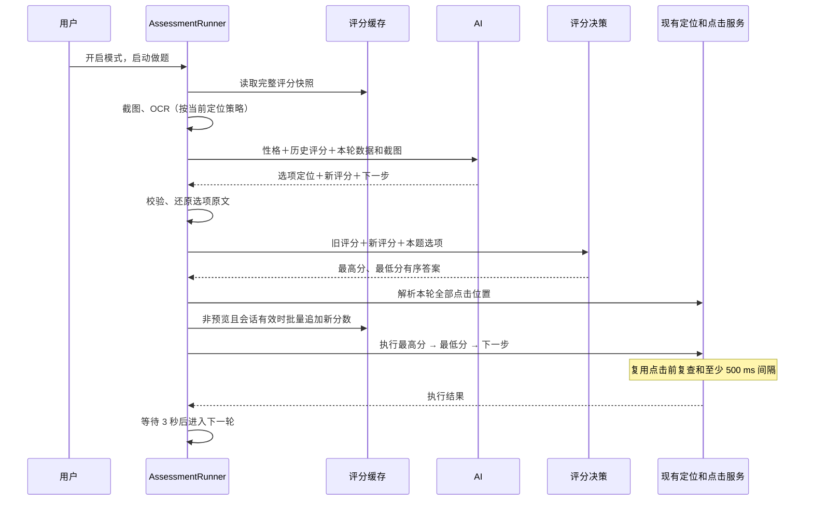

# 最符合／最不符合评分模式：完整实现方案

日期：2026-10-07  
状态：已按本方案实现业务代码，完成本地回归与真实 OCR 集成诊断；外部模型和实际测评网页尚未验收。

实现验证：119 项自动测试通过，类型检查与构建通过。集成诊断使用真实本地 OCR、模拟 AI 和 Chromium 输入，验证顺序点击、评分复用、预览及记忆隔离；没有发送外部 API 请求，也没有注入系统鼠标事件。新增独立的评分提示词、记忆模式协调和评分恢复检查模块，鼠标点击实现保持不变。

## 1. 目标与确定的范围

针对整套试卷都采用“第一次点击选最符合、第二次点击选最不符合”的题型，在设置中增加默认关闭的专用开关。

开启后，AI 识别本题选项及点击位置，参考个人性格和本次完整评分记忆，为新选项打 0～10,000 的整数分。程序复用旧分数，计算最高分、最低分，生成两个有序答案，直接接入现有定位与鼠标点击流程。

本期确定：

- 分数越高，表示越符合配置的个人性格，而不是选项本身越“优秀”。
- 已有选项的分数在同一次测评中保持不变，只给新选项评分。
- 缓存以选项内容为 key、分数为 value，不以题干或 A/B/C 标签为 key。
- 每次 AI 请求都携带本次完整评分记忆，包括重试请求。
- 一轮正常作答只调用一次 AI；不是点击一次就再请求一次 AI。
- 最高分先点击、最低分后点击；复用当前 500 ms 点击间隔、下一步和 3 秒循环等待。
- 复用当前截图、OCR、三种坐标策略、停止快捷键及页面变化重试。
- 本期不实现拖拽、随机鼠标移动、曲线运动、独立的双容器执行状态机，也不自动撤销已选项。
- 继续保留现有提交／交卷停止逻辑。

支持当前 2～26 个不同选项位置，主要使用场景为三选二。只有一个选项无法选出两个不同位置，应提示本题不符合该模式。

## 2. 当前代码及复用方式

| 现有模块 | 当前职责 | 新模式处理 |
| --- | --- | --- |
| `src/main/assessment.ts` | 读取设置、组装依赖、处理 IPC 和配置变化 | 注入评分缓存及决策模块，读取新增开关 |
| `assessment/prompt-builder.ts` | 组装固定提示词、历史、当前截图数据 | 增加评分模式请求分支 |
| `assessment/response-validator.ts` | JSON、选项及 OCR 引用校验 | 支持无 `answers`、有 `newScores` 的评分响应 |
| `assessment/runner.ts` | 分析、校验、定位、执行和记忆编排 | 在定位之前调用评分决策，生成 `answers` |
| `assessment/target-resolver.ts` | 按 `answers` 顺序生成选项与下一步点击计划 | 直接复用 |
| `assessment/coordinate-mapper.ts` | 截图坐标转换为屏幕坐标 | 直接复用 |
| `assessment/click-executor.ts` | 顺序点击、500 ms 间隔、停止检查 | 直接复用 |
| `src/main/click.ts` | PowerShell 调用 Windows `SetCursorPos`、`mouse_event` | 直接复用，不重写 |
| `assessment/page-guard.ts` | 点击前截图并比较题干和剩余目标像素 | 继续使用原有检查 |
| `assessment/controller.ts` / `retry-session.ts` | 循环、同题和页面变化的三次补充分析 | 继续使用；仅补充评分模式所需上下文适配 |

当前底层一次点击是：启动隐藏 PowerShell → 设置 DPI 感知 → 移到目标坐标 → 左键按下 → 等待 35 ms → 左键松开。500 ms 是执行器在相邻操作之间的等待，实际还包含截图检查和系统调用耗时。

## 3. 设置和模式关系

### 3.1 新增开关

```ts
assessmentMostLeastEnabled: false
```

界面名称：**最符合／最不符合模式**。

说明文字：开启后按个人性格为选项评分，先点击最高分选项，再点击最低分选项；已有评分在本次测评中复用。

主进程和前端持久化 store 都增加默认值。沿用当前设置同步机制；新增布尔配置不改变旧字段含义，无需为此升级持久化版本。

### 3.2 与原“性格测评模式”的关系

新增开关决定作答方式，原开关仍代表普通模式下的逐题记忆。优先级如下：

| 新模式 | 普通性格记忆开关 | 实际行为 |
| --- | --- | --- |
| 关闭 | 关闭 | 原普通作答，无个人性格和题目历史 |
| 关闭 | 开启 | 原性格作答，发送个人性格和逐题历史 |
| 开启 | 任意 | 按个人性格评分，使用专用评分记忆，不读取或写入普通逐题记忆 |

不强制修改用户原开关的保存值。开启评分模式时，普通记忆开关显示说明并暂不可操作，明确“当前使用选项评分记忆”。

复用 `assessmentPersonalityPrompt`。任一性格相关模式开启时，都显示个人性格编辑框；评分模式每次请求始终发送当前性格。未填写时继续使用已有默认性格。

复用“开始新测评 / 清空记忆”入口，同时清空两类记忆并停止当前任务。评分模式开关及性格设置持久化，评分数据本身不持久化。

## 4. 评分定义

取值为 0～10,000 的整数：

| 范围 | 解释 |
| --- | --- |
| 0～2,000 | 很不符合 |
| 2,001～4,000 | 较不符合 |
| 4,001～6,000 | 中性或一般 |
| 6,001～8,000 | 比较符合 |
| 8,001～10,000 | 非常符合 |

固定提示词要求：

1. 按同一份个人性格、同一套尺度独立评分，结合已有评分校准新选项。
2. 不得为了本题强行拉开高低，也不要求每道题出现低分选项。
3. 相近含义可参考旧分数，但不同文字不自动视为同一个选项。
4. 旧评分只读；返回新选项分数即可，不输出作答字母数组或评分解释。
5. 评分是与个人性格的符合程度；“最不符合”取本题相对最低分。

例如：不偏不倚 7200、胸怀宽广 9400、百折不挠 8800。程序选择胸怀宽广为最符合、不偏不倚为最不符合；7200 不代表“不符合”，只是本组三项中相对最低。

扩大数值范围降低同分概率，但不能消除同分，也不代表模型有同等精度的心理测量能力。

## 5. 会话评分记忆

### 5.1 数据结构

新增 `AssessmentScoreMemoryService`，核心数据是：

```ts
private scores = new Map<string, number>()
```

配合独立的会话 `sessionId` 和 `revision`，用于拒绝切换模式、清空或修改性格之前的迟到结果。

示例：

```ts
new Map([
  ['不偏不倚', 7200],
  ['胸怀宽广', 9400],
  ['百折不挠', 8800]
])
```

不使用 Redis、数据库或 localStorage 保存评分。500 道三选二题最多约 1500 个未去重词条，内存 Map 足以承担；实际费用更需要关注反复发送的上下文，而不是本地 Map 占用。

### 5.2 key 的来源和规范化

- OCR 模式：使用已有校验器根据 OCR 引用还原的正文，不能直接信任模型改写的 `options.text`。
- 其他定位模式：使用校验后的选项文本。
- 移除已有选项标签、统一 NFKC、首尾空白，并统一空格／换行。所有查询、写入和评分表输出使用相同规范化函数。
- 不删除否定词、程度词，不用模糊匹配自动合并不同描述。
- 字母编号和屏幕位置不参与 key；选项换序仍能复用。
- 同一 key 出现在两个位置时共享一个分数，但选择结果仍必须是两个不同的选项编号。

词条只追加，不排序重写旧表。新 key 按本题固定的字母顺序登记，使模型 JSON 属性顺序变化不会影响登记顺序。

### 5.3 生命周期

| 操作 | 评分缓存 | 普通逐题缓存 |
| --- | --- | --- |
| 启动软件 | 空 | 空 |
| 暂停／继续，普通轮次结束或可恢复错误 | 保留 | 按原模式保留 |
| 进入或退出评分模式 | 清空，创建／结束评分会话 | 清空，避免切回旧测评 |
| 修改个人性格 | 清空并停止当前任务 | 清空 |
| 开始新测评／清空记忆 | 清空并停止当前任务 | 清空 |
| 仅切换模型、坐标或截图配置 | 停止当前任务，保留当前性格下的评分 | 沿用原有行为 |
| 软件退出 | 丢弃 | 丢弃 |

设置重复同步但值没有变化时不得清空。新模式启用期间，普通记忆开关的同步不能意外开启普通记忆；按“有效记忆模式”统一配置两项服务。

### 5.4 写入时机

校验先生成本轮临时评分结果，只有响应、全部定位目标、会话版本和停止状态均有效后，才批量追加新评分，再进入点击流程。

- 任一新选项缺分或格式错误：本轮不写入任何新评分。
- 预览模式：只展示候选分数，不写入评分缓存，也不点击。
- 已有分数不覆盖；模型重复返回不同的合法分数时保留旧值并给非阻断提示。
- 写入后的点击失败不撤销分数：评分表示性格偏好，不表示已成功作答；重试继续使用这些分数。
- 同一个响应中的重复规范化 key 如给出冲突的新分数，本轮校验失败，不取随机一个。

## 6. AI 请求与缓存友好的序列化

### 6.1 请求顺序

```text
system：固定评分规则＋当前个人性格＋当前定位策略协议＋固定条件式重试说明
user 文本 1：本次完整历史评分，保持旧内容不变，新增词条追加在末尾
user 文本 2：本轮 JSON，包括 captureId、图片尺寸、OCR（如有）、recovery（如有）
user 图片：当前截图
```

评分模式不再发送普通 `assessmentHistory`，避免重复信息和普通答案语义干扰。

`Map` 不能直接 `JSON.stringify(map)`。建议固定标题后逐行输出 JSON 数组，正确转义选项中的引号和换行：

```text
assessmentScoreHistory:
["不偏不倚",7200]
["胸怀宽广",9400]
["百折不挠",8800]
```

由 `Array.from(scores, ([text, score]) => JSON.stringify([text, score])).join('\n')` 生成正文。空会话也保留标题，不在前部添加动态总数、时间、随机编号或会话 ID。

每次调用提供完整历史，不只发送本题命中的几项。新增记录只放末尾，有利于公共前缀复用；缓存命中仍取决于服务端，不能承诺特定命中率。

### 6.2 一次调用完成定位和新评分

不要先调用模型识别选项，再调用模型评分。直接将全量评分表、当前 OCR 和截图一同发出，让模型在一次响应里返回选项引用、新评分和下一步信息。

即使本题选项都已缓存，仍进行现有模型调用以识别当前选项位置、下一步及重试中的选中状态；此时 `newScores` 返回空对象。

## 7. AI 返回协议与校验

### 7.1 OCR 模式示例

下面是新增的评分响应结构。由有效模式选取专用严格 schema；普通 OCR v3 协议保持不变，评分分支使用 `schemaVersion: 3`，通过明确的 `mode` 区分：

```json
{
  "schemaVersion": 3,
  "mode": "most_least",
  "captureId": "本轮截图编号",
  "status": "ok",
  "question": "请选择最符合和最不符合自己的描述",
  "questionRegionIds": ["r001"],
  "options": {
    "A": { "text": "胸怀宽广", "regionIds": ["r005"], "clickRegionId": "r005" },
    "B": { "text": "善于交际", "regionIds": ["r006"], "clickRegionId": "r006" },
    "C": { "text": "谨慎细致", "regionIds": ["r007"], "clickRegionId": "r007" }
  },
  "newScores": { "B": 9500, "C": 7000 },
  "next": { "required": true, "kind": "next", "clickRegionId": "r010" }
}
```

假设历史已有“胸怀宽广 9400”，本轮不必再为 A 返回分数。

要求：

- `newScores` 使用本题字母作 key，服务端将其映射到规范化选项内容后存储。
- AI 不返回 `answers`，由程序计算。对这一点使用评分专用 schema，不能把现有必填 `answers` 简单改成全局可选。
- 保留 `uncertain` 分支；评分分支也带模式与当前 `captureId`。无法完成识别时不编造评分或定位。
- `selectedAnswers` 只在包含 `recovery` 的成功响应中必需，含义仍为当前画面确认的已选择项；AI 没有决定目标答案，只是在报告画面状态。
- 题目没有独立题干时，可以使用实际可见的操作说明作为题干引用，不能制造 OCR 框。题目身份还必须包含完整选项集合，不能只看各页重复的说明。

### 7.2 固定坐标和模型坐标模式

评分语义、`mode`、`newScores` 相同，选项沿用各自现有位置格式：固定位置不要求坐标，模型位置仍要求现有矩形。两者不伪造 OCR 引用。

新增定位策略无关的评分 schema 片段，复用现有各策略校验规则。输入格式、评分字段及分数范围不随定位策略改变。

### 7.3 校验职责分层

先进行 JSON、模式、当前截图及选项／下一步定位校验，再规范化正文并校验评分，最后派生答案后校验恢复状态。

- 所有返回的分数必须为有限整数，范围 0～10,000；不接受字符串数字、小数、负数或超范围值。
- `newScores` 的编号必须属于当前选项；不接收任意外部 key。
- 查表后，每个实际选项必须能取得一个分数；缺分不能填 0，也不能只在有分的选项中选最高最低。
- 旧分数优先；只批量增加此前不存在的 key。
- 至少两个实际选项，最高与最低必须对应两个不同编号。
- 保留已有 JSON 重复字段检查、OCR 引用检查、提交按钮拦截、坐标和停止检查。
- 普通模式和评分模式均通过 `ValidatedModelRequest` 对模型结果做结构与完整性校验。格式、引用或缺分错误在首次请求外最多纠错重试 3 次；每次反馈具体原因，不累积错误响应。无效轮次不写入记忆或点击，耗尽后停止。页面变化和模型不确定仍走既有补充分析，两项预算分别计数。

## 8. 最高／最低的确定算法

新增纯计算类 `AssessmentScoreDecision`：

1. 将每个选项映射成 `{ answer, text, score, firstSeenOrder }`。
2. 分数从高到低排序。
3. 同分时按本次评分缓存的首次登记顺序从前到后排序。
4. 相同文字重复出现在不同位置时，最后按字母顺序稳定排序。
5. 取排序后的第一个作为最符合，最后一个作为最不符合。
6. 输出 `answers: [mostAnswer, leastAnswer]`，以及用于界面展示的当前评分。

新词条的 `firstSeenOrder` 来自本轮候选追加顺序，预览时也可计算，不要求先写缓存。缓存不用为排序而重排，保持传给模型的历史前缀稳定。

示例：

| 编号 | 内容 | 分数 | 来源 |
| --- | --- | --- | --- |
| A | 胸怀宽广 | 9400 | 历史 |
| B | 善于交际 | 9500 | 本轮 |
| C | 谨慎细致 | 7000 | 本轮 |

程序生成 `answers = ['B', 'C']`。同分不增加一次模型调用，固定规则保证重试不随机换答案。

## 9. 执行、重试与普通记忆隔离

### 9.1 正常调用链



`runner.ts` 当前会先调用普通记忆的 `match()` 覆盖 `parsed.answers`，然后执行并 `commit()` 普通历史。评分模式必须绕过这两处及普通记忆容量检查，改为专用评分分支；不能先计算最高最低，再被旧普通答案覆盖。

将评分响应转换为包含程序生成 `answers` 的现有 `ParsedAssessment` 后，再交给 `AssessmentTargetResolver`、`remainingAnswerSteps` 和 `AssessmentClickExecutor`。

### 9.2 同题及页面变化

不新增每一步都调用 AI 的强制流程：无页面变化时直接完成现有顺序点击。若第一次点击让剩余卡片移动，现有 guard 会中断旧位置执行，再按原有流程重新截图分析。

重试要求：

- 每次仍发送全量评分记忆，已打分的选项不再改分。
- 沿用当前 `recovery` 中的选项内容、目标答案和已执行操作；不得把“执行过点击”直接视为“已选中”。
- 提示模型包含当前题目的全部选项，包括已移动到右侧容器的描述，按内容保持本题字母对应；不要只返回左侧剩余卡片并重新编号。
- 当前 `selectedAnswers` 按“最符合、最不符合”的实际选择次序报告，只有确认在容器中已选择时才加入，不用背景高亮单独认定。
- 服务端按规范化内容对齐同题的新旧字母；完整选项集合一致时才映射，不继承旧坐标。若既有恢复逻辑未覆盖该映射，在 runner／recovery 适配层补足，不改底层点击器。
- 已确认选择最高分时，仅保留最低分和下一步；两项均选好时只处理下一步。
- 未识别完整集合、无法区分已选状态或同文选项对应不唯一时，沿用不确定和有限重试，不将缺失选项当成自动换题依据。
- 新题判定结合现有题号／进度和完整选项集合；相同说明文字不代表同一道题。

保留当前最多三次补充分析规则。实际网页卡片移动、重复文字和 OCR 丢字仍可能影响恢复，属于验收时必须覆盖的兼容场景，不宣称每页都能无误完成。

## 10. 类和文件职责

尽量一个类负责一件事，不把评分逻辑直接堆进 runner。

| 新增文件 | 职责 |
| --- | --- |
| `src/shared/assessment-scoring.ts` | 评分范围常量、前后端展示所需类型；无 Node/Electron 依赖 |
| `src/main/assessment/score-memory-service.ts` | `AssessmentScoreMemoryService`：规范化 key、会话生命周期、查表、批量追加、稳定历史文本 |
| `src/main/assessment/score-decision.ts` | `AssessmentScoreDecision`：分数完整性、冲突与范围检查，计算最高最低；不执行点击 |

现有文件修改清单：

| 文件 | 改动 |
| --- | --- |
| `src/main/settings.ts` | 默认值，按有效模式配置记忆，配置变化时失效旧会话 |
| `src/renderer/src/lib/store/settings.ts` | 设置类型与默认值 |
| `src/renderer/src/settings/sections/AssessmentSection.tsx` | 新开关、模式关系说明、个人性格和清空入口显示条件 |
| `src/main/assessment/types.ts` | 运行配置和评分解析结果类型，区分未决策响应与已有完整答案 |
| `src/main/assessment/prompt-builder.ts` | 评分规则与专用输出格式，全量评分历史前置 |
| `src/main/assessment/response-validator.ts` | 评分响应分支，复用定位校验，调整答案相关校验顺序 |
| `src/main/assessment/runner.ts` | 在定位前生成答案，隔离普通记忆，控制评分提交和恢复对齐 |
| `src/main/assessment/recovery.ts`、`retry-session.ts` | 必要时补充同题内容映射，保留三次重试机制 |
| `src/main/assessment.ts` | 服务实例与依赖注入，统一清空两类记忆 |
| `src/shared/assessment.ts` | 结果中增加可选评分展示字段 |
| `src/renderer/src/assessment/` | 在现有结果区增加当前选项分数、来源和最高／最低标识 |
| `tests/` 及 `assessment/self-test.ts` | 评分、模式隔离及集成回归 |

设置继续通过现有 IPC 同步；清空继续使用现有 `assessment:reset-memory`。结果通过现有快照通道发送，无需另建 HTTP 服务或为评分 Map 新增数据库。

不修改现有鼠标注入、坐标换算和点击间隔实现。

## 11. 界面展示

保留现有原始 AI 输出、选项坐标、点击计划等展示，增加当前题目评分表：

| 选项 | 内容 | 分数 | 来源 | 操作 |
| --- | --- | --- | --- | --- |
| A | 胸怀宽广 | 9400 | 历史评分 | — |
| B | 善于交际 | 9500 | 本轮评分 | 第一次：最符合 |
| C | 谨慎细致 | 7000 | 本轮评分 | 第二次：最不符合 |

原始 AI 输出忠实保留，不把程序派生的 `answers` 伪装成模型输出。程序结果区显示最终执行答案；历史分数覆盖模型重评分时显示简短提示。

## 12. 实施顺序

1. **设置和类型**：新增开关，定义评分范围与结果类型，明确模式优先级和性格显示。
2. **评分缓存与决策**：实现纯逻辑、会话清理、稳定序列化、最高最低及同分规则，先验证单元测试。
3. **请求和响应**：增加固定评分提示词、前置全量评分历史、严格评分响应分支，保留普通协议。
4. **接入 runner**：派生 `answers`，跳过普通记忆覆盖，复用现有定位、点击与重试，检查同题映射。
5. **结果展示**：显示评分、来源、点击顺序，复用清空和原始输出入口。
6. **回归和人工验收**：通过自动检查后，在真实目标网页测试短套和长套；验证后再打包安装版。

## 13. 测试与验收

### 自动测试

- 0、10,000 合法；负数、超范围、小数、字符串、缺分、陌生选项编号均不能进入执行。
- 全新、部分重复、全部重复选项；已有分数绝不被覆盖。
- 同分、全部同分、选项换序、重复文字，仍返回两个不同编号且结果稳定。
- 普通作答、普通性格记忆、新评分模式互不串数据；原记忆不覆盖评分决策。
- 关闭／开启、改性格、清空、停止期间的迟到响应不能污染新会话。
- 同一评分会话正常与重试的 system 完全一致；新增评分只扩展历史文本末尾；随机编号和 OCR 位于历史后。
- 预览不点击、不提交新评分；校验失败不部分提交，点击失败后评分可在重试中复用。
- OCR／固定坐标／模型坐标均执行最高、最低、下一步的同一有序计划，复用 500 ms 间隔。
- 首次点击后卡片移动、已完成第一步、已完成两步、下一步漏点、字母换序、真正的新题。
- 保留原有页面变化／同题三次补充分析、停止、提交拦截和普通题回归测试。
- 使用模拟 AI 执行 500 道三选二题，检查词条去重、稳定追加、无会话泄漏；这不是模型评分质量或服务端缓存命中率测试。

验证命令沿用项目方式，新测试文件实现后加入测试列表：

```powershell
node --test tests/assessment-options.test.cjs tests/ocr-filter.test.mjs tests/assessment-ocr.test.mjs tests/assessment-scoring.test.mjs
npm run build
```

对改动文件执行 ESLint 和 `git diff --check`。本地集成诊断可使用真实 OCR、模拟 AI 和 Chromium 测试页验证排序后的点击链，不等同于外部模型与实际网站验收。

### 实际页面验收

1. 开关默认关闭，老用户升级后原功能可用。
2. 启用新模式后每题显示实际分数，并按最高→最低操作。
3. 下一题再次出现同一描述，显示“历史评分”，数值一致。
4. 卡片不移动时一题不新增额外 AI 调用；发生变化时按现有有限重试恢复。
5. 连续运行目标题套，观察点击顺序、下一步、停止和清空是否正常。
6. 用实际 API 账单比较缓存命中／未命中输入、输出和调用次数；只报告实测结果，不预设提升比例。

完成标准：评分和历史可追踪、普通模式兼容、点击服务直接复用、测试通过，并在目标网页完成实际验收。当前本地实现与验证已完成，实际模型响应质量、卡片移动页面的兼容性和缓存命中率仍以目标环境测试为准。
