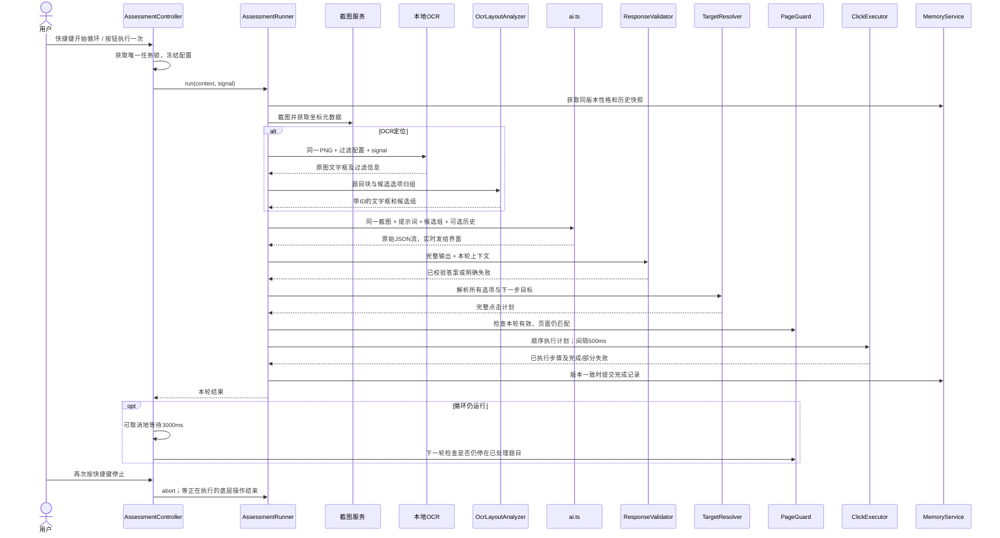

> 更新：OCR 路径已改为 v3，由 AI 从全部文字框中选择题干、选项和点击框，本地不再预分组。本文其余分组设计作为历史方案；当前实现以 [使用说明](assessment-ocr-usage.md) 为准。

# 做题模式：OCR 多行选项归组与点击定位设计

日期：2026-10-04。

状态：首版代码已实施。本文保留设计决策与初始参数；实际行为、校准后的参数、验证命令及尚未完成的扩展见 [使用与实现说明](assessment-ocr-usage.md)。不将设计中的后续扩展视为已经实现。

## 1. 目标与整体决策

OCR 负责提供文字及位置，程序负责生成候选分组，大模型结合同一张截图确认题目、选项归属和答案，程序根据已经存在的文字框生成点击计划。

例如，一个选项换成两行，OCR 得到 r1、r2 两个框。将它们关联到选项 A，但仍保留两个原始框的坐标。选择 A 时取已验证的文字框内部点，不让大模型重新生成坐标，也不直接点击两行合并大矩形的中心。

主要决定：

- 复用现有截图、本地 OCR、AI 配置、流处理和 Windows 点击服务，不新增 Python、HTTP 服务、数据库或依赖注入框架。
- 主进程负责所有业务判断和任务状态；前端只修改配置、展示结果和发送开始/停止请求。
- 一轮只处理一道完整题目。第一版支持单列、文字选项；复杂多列、图片选项、只有圆圈可点击的页面明确报告定位不支持，用户可选择已有固定坐标模式。
- 每个有独立业务职责的服务一个类、一个文件。坐标公式、字符串规范化等无状态的小逻辑仍使用纯函数，不为每个函数创建一个类。
- 新 OCR 定位先作为可选配置，默认关闭，逐阶段验证后再决定是否调整默认值。固定坐标始终优先，不发生自动坐标来源切换。
- OCR 定位失败时停止并说明原因，不悄悄退回 AI 估算坐标，不自动重复已执行的点击。

## 2. 当前代码与需要接入的位置

| 当前文件                                      | 当前职责                                                      | 本方案处理                                                  |
| --------------------------------------------- | ------------------------------------------------------------- | ----------------------------------------------------------- |
| `src/main/assessment.ts`                      | 截图、拼提示词、AI 解析、坐标换算、点击、记忆写入、循环和 IPC | 保留对外入口，逐步将内部实现拆到专用服务                    |
| `src/main/ai.ts`                              | 独立做题模型配置及系统提示词、流式请求                        | 保留唯一 AI 请求入口，增加 OCR 协议，并支持传入本轮配置快照 |
| `src/main/take-screenshot.ts`                 | 截图及尺寸、裁剪偏移、屏幕原点                                | 继续复用；补充显示器标识和采集时间以支持同源复查            |
| `src/main/ocr/index.ts`                       | OCR 进程、单请求、取消、超时、闲置释放、结果过滤              | 继续复用；允许调用方显式传入本轮边缘配置，缺省使用当前设置  |
| `src/shared/ocr.ts`                           | OCR 数据类型、四边过滤                                        | 保持通用，不加入“题目”“A/B/C/D”业务                         |
| `src/main/assessment-memory.ts`               | 会话数组与 Map、上下文、题号去除                              | 复用并封装会话生命周期，增加版本检查和内容键修正            |
| `src/main/click.ts`                           | Windows 物理屏幕坐标点击                                      | 继续作为底层执行器，不理解答案和 OCR                        |
| `src/main/shortcuts.ts`                       | 做题快捷键、停止入口                                          | 保留现有动作，转发到统一循环控制器                          |
| `src/renderer/src/assessment/index.tsx`       | 做题界面、AI 原始输出、结果、手动点击 Demo                    | 保留布局与现有信息，追加 OCR 分组预览、阶段状态             |
| `src/renderer/src/settings/LocalOcrPanel.tsx` | OCR 测试及边缘过滤                                            | 保留，测试与实际做题使用同一过滤实现                        |

当前 OCR 还未接入自动做题流程。当前单次分析 IPC 与快捷键循环也未共享完整的任务锁，不能仅增加一个 OCR 调用就认为并发、取消问题已经解决。

## 3. 职责拆分与文件结构

保留 `src/main/assessment.ts` 作为兼容入口；新增 `src/main/assessment/` 目录。目录内部使用明确的相对路径，避免同时存在同名文件和目录时产生导入歧义。

| 类 / 文件                                               | 只负责什么                                            | 主要方法                                               | 不负责什么                          |
| ------------------------------------------------------- | ----------------------------------------------------- | ------------------------------------------------------ | ----------------------------------- |
| `AssessmentController` / `controller.ts`                | 单次/循环任务生命周期、互斥、取消、状态快照           | `runOnce()`、`toggleLoop()`、`stop()`、`getSnapshot()` | 不分析文字，不计算坐标              |
| `AssessmentRunner` / `runner.ts`                        | 编排一轮业务阶段                                      | `run(context)`                                         | 不内嵌归组公式、JSON 规则或鼠标指令 |
| `OcrLayoutAnalyzer` / `ocr-layout-analyzer.ts`          | 将原始文字框组织为题目块和候选选项组                  | `analyze(capture, ocr)`                                | 不决定正确答案，不点击              |
| `AssessmentPromptBuilder` / `prompt-builder.ts`         | 根据本轮配置、布局、记忆构建提示词和消息              | `build(input)`                                         | 不读取不断变化的全局设置，不请求 AI |
| `AssessmentResponseValidator` / `response-validator.ts` | JSON 结构及答案、文字框引用、分组归属校验             | `parseAndValidate(raw, context)`                       | 不调用 AI 修复，不执行点击          |
| `AssessmentTargetResolver` / `target-resolver.ts`       | 根据固定/OCR/旧 AI 坐标策略解析目标，生成完整点击计划 | `resolve(context, answer)`                             | 不操作鼠标，不等待下一题            |
| `AssessmentClickExecutor` / `click-executor.ts`         | 按计划依次执行点击并返回执行记录                      | `execute(plan, signal)`                                | 不生成答案，不决定点击哪个选项      |
| `AssessmentPageGuard` / `page-guard.ts`                 | 检查画面是否仍适合执行该计划、是否进入下一题          | `checkBeforeClick()`、`checkProgress()`                | 不把任意像素变化当成“已选中”        |
| `AssessmentMemoryService` / `memory-service.ts`         | 性格会话生命周期、上下文快照、成功记录提交            | `snapshot()`、`reset()`、`commit()`                    | 不保存截图，不执行点击              |

辅助文件：

- `src/shared/assessment.ts`：前后端共享的结果、阶段、错误和调试数据类型，移除前端对主进程 `AssessmentResult` 的类型依赖。
- `src/main/assessment/coordinate-mapper.ts`：图片坐标转屏幕坐标的纯函数。
- `src/main/assessment/grouping-config.ts`：内部归组参数及注释。
- `src/renderer/src/assessment/OcrDebugPanel.tsx`：截图上的分组框、选项和候选点击点。
- `src/renderer/src/lib/store/assessment.ts`：主进程状态的前端副本，不持久化截图和原始输出。

组装方式：在兼容入口手动创建服务实例，构造函数传入所需依赖。只有控制器、记忆服务需要跨轮次保存业务状态；布局、校验、目标解析不缓存上一题。

依赖方向：入口 → 控制器 → 单轮编排器 → 专用服务 → 现有底层能力。底层 OCR 和点击服务不得反向依赖做题编排器。服务通过返回值或注入的事件回调报告结果，不在每个类中访问 `global.mainWindow`。

## 4. 与现有功能的兼容规则

| 现有功能                               | 接入后的行为                                                         |
| -------------------------------------- | -------------------------------------------------------------------- |
| 截图解题、对话模式                     | 不接入本次 OCR 分组，也不改变模型和提示词                            |
| 做题独立 API 配置                      | 继续使用做题 profile 的 URL、Key、模型、请求头和思考配置             |
| 固定选项坐标、固定下一步坐标           | 优先级最高；跳过 OCR 定位，不要求返回文字框引用，不额外承担 OCR 耗时 |
| 原 AI 坐标模式                         | OCR 定位关闭时继续使用，但解析与执行也经过拆分后的统一校验/计划流程  |
| 不固定选项数量                         | 支持当前的 A–Z、1–26 个实际选项，不补齐四项；两项、三项均有效        |
| 单选、多选、顺序选择                   | 统一使用有序 `answers` 数组，不排序，不改成 Set；重复答案仍拒绝      |
| 点击间隔                               | 保持两次点击之间至少等待 500 ms；有下一步时也等待 500 ms             |
| 循环快捷键                             | 同一快捷键开始/停止；一轮结束后等待 3000 ms 再开始下一轮             |
| 性格与会话记忆                         | 独立于定位方式和循环开关；关闭时不附带人格或历史、不写记录           |
| 手动 ABCD 点击 Demo                    | 保留；自动执行期间通过主进程任务状态拦截冲突的手动点击               |
| 灰色背景、透明度、固定顶部、悬浮工具栏 | 复用当前布局与工具栏，不新增改变窗口行为的控件                       |
| AI 原始输出                            | 原样保留，另展示 OCR 与校验后的结果，不用整理后的 JSON 替换原始输出  |
| 设置页往返                             | 返回原模式；主进程持有本轮状态，前端重新挂载时读取快照               |

定位策略只有一个最终选择：

```text
assessmentFixedClick = true → fixed
否则 assessmentOcrEnabled = true → ocr
否则 → model
```

不再另外持久化一份“当前策略”，避免多个配置互相矛盾。固定模式打开时，界面说明“OCR 定位暂不使用”。

## 5. 一轮任务的数据与时序

### 5.1 同一轮必须固定的数据

每轮创建 `runId`，捕获一次配置快照，包括 AI profile、坐标策略、固定坐标、过滤参数、性格内容、记忆 sessionId/revision、截图目标。不可在执行到一半时重新读取新配置。

截图对象再带 `captureId`、采集时间及显示器 ID。OCR 和 AI 使用完全相同的 PNG；OCR 返回的 `imageSize` 必须与该 PNG 一致。

OCR 数组转为：

```ts
interface AssessmentRegion {
  id: string // e.g. r001; valid only inside one captureId
  text: string
  score: number
  box: { left: number; top: number; right: number; bottom: number }
}

interface OptionCandidate {
  id: string // e.g. g001
  questionBlockId: string
  regionIds: string[]
  labelHint?: string
  joinedText: string
  ambiguous: boolean
}
```

编号在一次 OCR 输出上生成，不因排序/过滤后的位置重新解释。唯一身份是 `captureId + regionId`；重新截图或局部重识别后必须重新建立映射，不允许旧响应引用新截图中的同名 r001。

### 5.2 主流程时序图



异常路径在校验或页面检查失败时结束，不向下执行。单次按钮只运行一轮；快捷键才循环。暂停等待和 AI/OCR 共用取消信号。

## 6. 多行选项归组算法

### 6.1 先确定题目范围，再组合行

不能把全屏文字按 y 排序后直接合并。第一版处理顺序：

1. 使用已有四边过滤，保留原图坐标；过滤只执行一次。
2. 保留有效的文字框，检查有限坐标、正面积和图片边界。
3. 根据题号、题型文字、相邻正文、明显留白和列位置生成候选题目块。题号只是边界线索，不能把 SQL 里的数字认成新题。
4. 在同一候选块和同一列中寻找选项标记及相邻续行。
5. 给大模型提供候选块、组和原始截图，要求只确认一道完整题目。单靠局部规则无法确认题目边界时标为歧义，不直接点击。

第一版多题同屏策略：选择从上到下第一道完整、未处理的题目。其余块不与该题选项混用。做完该题后若页面未跳转，停止并提示换题/调整截图范围，不自动转去同屏下一题；以后再扩展多题页面调度。

两列排版、跨列续行、图片选项先不自动定位。保留信息并提示“不支持的布局”，不为了完成任务强行扁平化为单列。

### 6.2 候选归组参数

这些是内部默认值，首版不增加一屏复杂的用户参数；真实样本验证后统一调整。`h` 是该候选区域内普通文字框高度的中位数，排除图标及异常大框。

| 参数                         | 初始值 | h=38 像素时                | 用途                               |
| ---------------------------- | ------ | -------------------------- | ---------------------------------- |
| `maxContinuationGapRatio`    | 0.6    | 22.8 像素                  | 两行间空隙上限                     |
| `maxContinuationIndentRatio` | 1.5    | 57 像素                    | 相邻行左侧位置差上限               |
| `maxVerticalOverlapRatio`    | 0.3    | 11.4 像素                  | 容忍 OCR 相邻行文字框少量重叠      |
| `minHorizontalOverlapRatio`  | 0.6    | 短行宽300时至少重合180像素 | 避免拼接明显不在同列的文字         |
| `rowCenterToleranceRatio`    | 0.5    | 19 像素                    | 区分同一行的小字母标签与下一行正文 |

计算方式：

```text
gap = 下一行.top − 上一行.bottom
indent = abs(下一行.left − 上一行.left)
水平重合比例 = 两框水平方向重合宽度 / 两框中较短的宽度
```

无新的选项起始标记，且在同一块、同一列时，满足上述续行条件才合并。新标记的优先级高于行距；没有标记且间距证据不充分时保留歧义。水平重合与缩进规则是候选启发式，不是正确性证明。

对于独立的 `A` 文字框，可将它与同一行右侧最近、对齐且无竞争标签的正文建立关联；不能把侧边栏的单个字母也当选项。程序识别标记时兼容 `A.`、`A）`、`A、`、`(A)`、`A．` 等；正文出现 `A.value` 不自动切组。

### 6.3 本次 SQL 样本的解释

从用户日志取四行，坐标四舍五入用于说明：

| ID   | left | top  | right | bottom | 文字摘要                              |
| ---- | ---- | ---- | ----- | ------ | ------------------------------------- |
| r001 | 479  | 916  | 1990  | 953    | SELECT ... SUM ... =                  |
| r002 | 504  | 951  | 1723  | 990    | Categories.category_id JOIN Sales ... |
| r003 | 484  | 1040 | 1749  | 1074   | SELECT ... COUNT ...                  |
| r004 | 503  | 1074 | 1995  | 1112   | Products.category_id = ...            |

`r001 → r002` 的 gap 为 -2，indent 为 25，符合续行条件；`r002 → r003` 的 gap 为 50，超过约 23，应分开；`r003 → r004` 的 gap 为 0，符合续行条件。因此生成两组，而不是把四行当成四个选项。

文本组合使用换行符，保留 SQL/代码空格、标点及原始每行文字。`product _id` 等疑似识别错误由大模型结合截图解释，不在底层统一删空格或补字符。组合框只用于预览与区域判断，不直接决定点击点。

## 7. 大模型输入、输出与校验

### 7.1 输入

在 `AssessmentPromptBuilder` 中组装：协议要求、可选人格设定、可选会话记录、当前截图、captureId、图片尺寸、过滤说明、OCR 行及候选组。

系统提示词要求只返回 JSON；将 OCR 和历史放在有明确边界的数据块中，截图里的文字作为题目资料处理。普通模式完全不发送人格和历史。固定坐标模式继续返回文字/答案，不要求 OCR 引用。

优先维持一次 AI 请求：在一次请求里完成题目确认、分组确认和解题。OCR 必须先于这次请求完成；不能为了“并行”让 AI 看到另一次截图的文字框。

### 7.2 OCR 模式的输出协议 v2

以下为两选项页面的完整示例；r005 假设是“下一步”的文字框。实际 ID 必须来自本轮输入。

```json
{
  "schemaVersion": 2,
  "captureId": "cap-example",
  "status": "ok",
  "questionBlockId": "q001",
  "question": "这里填写完整题干",
  "answers": ["A"],
  "options": {
    "A": {
      "text": "第一个选项的完整文字",
      "regionIds": ["r001", "r002"]
    },
    "B": {
      "text": "第二个选项的完整文字",
      "regionIds": ["r003", "r004"]
    }
  },
  "next": {
    "required": true,
    "kind": "next",
    "regionIds": ["r005"]
  }
}
```

无法确认时返回另一种严格结构：

```json
{
  "schemaVersion": 2,
  "captureId": "cap-example",
  "status": "uncertain",
  "reason": "第二个选项底部没有显示完整"
}
```

`uncertain` 不允许附带可执行答案。没有下一步时使用 `{"required":false}`；有时 `kind` 只能是 `next`、`continue`、`submit`，必须提供可验证引用。

选项字母按截图标签确认；页面本来没有字母时，只有模型确认选项完整、布局单列且顺序明确，才沿用现有从上到下编号规则。不可把“字母漏识别”当成“页面无字母”。

第一版下一步仅自动执行明确的“下一步/下一题/继续”。`submit` 涉及提交整卷/子卷，停止并显示需人工处理；“提交本题”与“交卷”未区分清楚前不合并为下一步。该行为比现有提示词把“提交”一起处理更保守，需在界面说明。

### 7.3 服务端分层校验

使用项目已有 Zod 做结构校验，再执行引用与业务校验；不依赖模型支持 JSON Schema。

1. JSON：只接受一个完整对象，可兼容整段外包的单个 JSON 代码围栏；不再用贪婪正则从任意解释文字中拼对象。限制响应体大小并拒绝重复键，避免 A 被后一个同名字段静默覆盖。
2. 结构：schemaVersion、status、字符串、数组、对象和必需字段符合约定，禁止 OCR 协议混入可执行 x/y 坐标。
3. 答案：1–26 个真实选项，答案非空、去重校验但不排序；每个答案都能在 options 中找到。
4. 引用：captureId 匹配；所有 regionIds 存在且非空；同一文字框不能属于两个不同选项；不能引用过滤掉的框。
5. 空间：选项属于同一个题目块和受支持的列，续行邻接合理；模型纠正候选分组也必须重新经过几何校验。
6. 语义：选项文本与引用文字不能明显互不相干；OCR 字符修正单独标注。简单的相似度不能证明 SQL 含义一致，证据不足时按不确定处理。
7. 下一步：与选项框分离，文字和截图证据支持该动作；不能把“返回顶部”“交卷”“退出”认成普通下一步。

校验失败返回带阶段及可读原因的错误，不执行任何点击。第一版不自动发第二次 AI 请求修复；后续若加入，只允许在零点击且页面仍匹配时有限重试。

## 8. 从选项到屏幕点击

### 8.1 完整点击计划

`AssessmentTargetResolver` 必须在第一次点击前解析并验证所有步骤，包括固定下一步坐标。避免已经点了两个选项，才发现第三个坐标缺失。

```ts
interface ClickStep {
  kind: 'answer' | 'next'
  answer?: string
  source: 'fixed' | 'ocr' | 'model'
  regionId?: string
  imagePoint?: { x: number; y: number }
  screenPoint: { x: number; y: number }
}

interface ClickPlan {
  runId: string
  captureId: string
  steps: ClickStep[]
  intervalMs: number // 500
}
```

按 `answers` 原顺序生成 answer 步骤，next 只追加在最后。固定坐标直接作为物理屏幕坐标，不再乘缩放系数；OCR 和旧模型坐标只换算一次。

### 8.2 OCR 文字定位策略

首版只支持点击文字可选中的页面。取选项已确认分组中的第一行正文框中心，不取大组合框中心，也不把孤立标签或低置信度图标优先作为目标。全部候选框都不可靠时停止。

示例 r001 中心：

```text
x = (479 + 1990) / 2 = 1234.5
y = (916 + 953) / 2 = 934.5
```

内部保留小数，最终换算到物理屏幕后只取整一次。

对于只能点击圆圈/复选框的页面，后续在 `target-resolver.ts` 中增加独立 `ControlLocator` 接口实现：在选项附近做局部模板/形状定位，返回控件中心。第一版不实现这个后备策略，不使用“文字 x 减 30”之类的网站假设。

### 8.3 统一坐标公式

沿用当前 `ScreenshotCapture` 字段语义：

```text
screenX = round((imageX + offsetX) × physicalWidth / fullWidth + originX)
screenY = round((imageY + offsetY) × physicalHeight / fullHeight + originY)
```

示例：完整截图 1280×800，物理屏幕 2560×1600，裁剪起点 (100,50)，裁剪图中的文字点 (200,150)，屏幕原点 (0,0)：

```text
screenX = (200 + 100) × 2560 / 1280 = 600
screenY = (150 + 50) × 1600 / 800 = 400
```

四边过滤不裁图，所以它不会产生额外 offset。图片尺寸和 OCR 返回尺寸不一致则拒绝，不能硬编码 1.5 倍或把 2559 手动补成 2560。

现有点击服务只支持 Windows，且拒绝负坐标；当前屏幕原点算法也需要混合 DPI 多屏验证。首版不宣称解决了负坐标、多屏混合 DPI，发现不支持的目标应在计划阶段拒绝，不能等点了一半才报错。

同时修正截图来源匹配的边界：当前 `findScreenSource(...) ?? sources[0]` 可能在没有匹配屏幕时抓到另一块屏幕，却仍使用原目标的尺寸/原点。用于自动点击时必须匹配成功才返回截图，否则报告截图失败，不允许图片与元数据来自不同显示器。

## 9. 循环、页面变化与停止语义

### 9.1 唯一任务控制器

状态使用 `idle → capturing → recognizing → analyzing → validating → locating → clicking → waiting`，另有 `stopping` 和 `error`。

快捷键循环与单次按钮共用互斥锁；在任务运行时单次请求返回“正在做题”。OCR 测试也复用现有 OCR 单请求限制，忙时明确提示，不偷偷排队长期持有截图。

所有异步结果带 runId，取消/换代后不得发结果事件、继续点击或写记忆。停止使等待、OCR、AI 尽快取消；底层已发出的鼠标按下/抬起不能撤回，必须等它结束并确保抬起。新任务在旧执行器结束前不得获得锁。

不要用 `Promise.race` 结束等待就认为底层点击已经取消。当前 PowerShell 点击操作需要明确超时和收尾策略；单个点击异常或状态不明时结束本轮，不自动重发。

### 9.2 防止旧截图点击及重复点击

AI 可能耗时十几秒，用户也可能滚动页面。`PageGuard` 在首次点击前对同一显示器、同一截图区域复查，并确认窗口/显示器几何信息未改变；不再使用鼠标当前所在屏幕重新选择目标。

比较限定在题干和目标区域，排除计时器等动态 UI。图片差异阈值需要真实样本标定，不把全屏哈希不同直接认成换题，也不把哈希相同当成控件必然可点击。第一版宁可因无法确认而暂停，不在页面已明显变化时继续。

初始实现可采用以下可测试规则，阈值只是待标定的工程初值：

| 参数                       | 初始值              | 判断方法                                           |
| -------------------------- | ------------------- | -------------------------------------------------- |
| `guardMaxSide`             | 640像素             | 仅把对比用的同一局部区域等比缩小，保留原图用于点击 |
| `pixelDifferenceThreshold` | 灰度差20，范围0–255 | 两张局部图同位置灰度差大于20计为变化像素           |
| `maxChangedPixelRatio`     | 0.02                | 变化像素超过被检查像素的2%，认为画面需要重新确认   |
| `maxInitialPlanAgeMs`      | 60000毫秒           | 第一次点击距离原截图超过60秒，停止要求重新开始     |

首次点击前必须对比；每个后续点击前也检查题干与尚未执行的目标区域，排除已点击控件的选中色变化。执行器通过注入 `beforeStep` 回调请求 PageGuard 检查，本身不实现图像算法。未超阈值仅表示“未检测到明显变化”，不是选中成功证明；超过阈值先停止，不盲目重复整轮。复查帧及时释放，不保留到会话记忆。

下一轮的停留检测使用“本地执行记录 + 当前重新识别的题干/选项 + 布局状态”共同判断，不能只按题干哈希决定已答过；性格题可能真的重复出现。无法区分同题重复与页面未前进时暂停提示，不猜测继续。

执行过程中若页面提前自动跳转，终止旧计划的剩余点击。对顺序题中“每点击一次布局都会改变”的场景，首版明确不支持一次快照执行到底，需要后续扩展逐步重新定位。

没有下一步按钮时仍等待 3 秒，不盲点页面其他位置。下一轮如仍识别到刚处理过的题干、选项和同一页面状态，暂停提示“页面未切换”，不再重复选择，避免多选被反选。这个短期执行记录属于循环状态，普通模式同样需要，与性格记忆独立，不发送给模型充当人格历史。

### 9.3 点击完成不等于选中成功

首版 `ClickExecutor` 只能确认系统点击调用完成，记录为 `executed`；部分完成返回已执行步骤，不能标成全部完成。结果界面显示“已执行点击”，不声称已验证网页选中。

真正的 `confirmed` 需要识别勾选/单选圆点/选中背景或可靠的题目跳转。先预留结果状态和验证接口，后续按页面样本实现。未知状态不自动补点，多选题尤其不能把重复点击当作重试。

## 10. 性格记忆与中途修改配置

`MemoryService` 继续使用有序数组 + Map，不引入磁盘持久化。只保存题干、选项、答案顺序与必要执行状态，不保存截图、OCR 框或旧屏幕坐标。

| 事件                                       | 决策                                                                    |
| ------------------------------------------ | ----------------------------------------------------------------------- |
| 普通模式                                   | 记忆上下文为空，不发送人格，不提交会话记录                              |
| 开启性格模式                               | 新建会话并增加 revision                                                 |
| 关闭性格模式                               | 清空会话并增加 revision                                                 |
| 性格内容改变                               | 停止当前任务，清空旧人格会话；下次开始使用新人格                        |
| 停止再开始做题                             | 人格配置未变时保留同一会话；提供“开始新测评/清空记录”入口区分新的一套题 |
| 定位方式、固定点、过滤、模型或截图目标改变 | 停止当前轮次，防止新旧配置混用；人格未变不清记忆                        |
| 透明度、工具栏等界面设置改变               | 不打断做题                                                              |
| 旧请求结束                                 | 只有 sessionId、revision、runId 仍匹配才可提交                          |
| 部分点击失败、取消、干跑                   | 不写成功记录；失败详情只在当前调试状态展示                              |

首版所有计划步骤正常返回后可按现有行为记录答案，但标明执行完成未视觉确认；不能将它包装成网页提交成功。后续有可靠验证时升级为 confirmed。

题目身份继续区分“题干相同”和“题干 + 选项内容相同”。当前源码的 `contentQuestionKey` 对带 `A=`、`B=` 标签的字符串排序，仍然包含字母，会导致换序后无法得到相同内容键。封装记忆服务时应修正为：

```text
exactKey：题干 + 按页面顺序排列的 [字母, 选项文本]
contentKey：题干 + 只按选项文本排序的数组（保留重复项的数量）
```

例如以前 A=苹果、B=香蕉，现在 A=香蕉、B=苹果，内容键相同，但准确答案必须按“苹果”重新映射到 B，不能复用旧字母 A，更不能复用旧坐标。相同文本出现多次时不能仅按文本确定唯一选项，应交给当前截图确认。

继续去掉明确的题目前缀编号，不能删除题干开头本来有意义的数字。记录规模按本次会话最多 500 条设计；达到上限明确提示开始新测评，不悄悄丢掉旧答案。500 条记录不代表一定能放进模型上下文：发送前估算当前 profile 的可用预算，默认保留全部历史；超限提示处理，不静默截断造成性格记忆不一致。摘要/检索压缩作为后续独立改进。

## 11. 设置、调试与资源占用

### 11.1 设置项

| 设置                       | 默认值        | 说明                                               |
| -------------------------- | ------------- | -------------------------------------------------- |
| `assessmentOcrEnabled`     | false         | 新增；非固定坐标时启用 OCR 定位                    |
| `ocrFilterMargins`         | 上下左右各100 | 复用；单位为本次输入图片像素，0关闭某边            |
| `assessmentOcrPreviewOnly` | true          | 新增；OCR 首次接入默认只分析并显示分组，不实际点击 |
| `assessmentShowOcrDebug`   | false         | 新增；按需显示截图、文字框和目标点                 |
| `assessmentFixedClick` 等  | 沿用现值      | 不改变用户已保存的固定坐标                         |

预览模式只作用于 OCR 策略，快捷键执行一次预览后结束，不形成每 3 秒重复请求的收费循环；界面明确显示“预览模式，未点击”。确认分组效果后由用户关闭预览，即使用自动点击流程。关闭 OCR 或固定模式不受这个调试开关影响。

归组的 0.6、1.5 等先作为有说明的内部配置，不要求用户理解算法。设置持久化沿用 Zustand → IPC → main，新增字段使用默认值兼容旧数据，不为新字段单独升版本。

### 11.2 调试视图

保留“AI 原始输出”和现有结果，在其后追加：

- 原始/过滤/保留文字框数量及使用的过滤参数。
- 每个题目块、候选选项组、最终字母关联，点击红点及坐标来源。
- 单独显示 OCR、AI、点击、整轮耗时；OCR elapsedMs 仍不含首次加载。
- 出错阶段、具体原因、已执行步骤；分清“识别失败”“关联失败”“坐标无效”和“点击调用失败”。

预览可以用 Canvas 在原图上画框；显示缩放比例单独计算，仅用于绘制，不能把预览坐标送回点击服务。不要为了预览另截一张屏幕。

主进程保留最新一轮结果供设置页往返后恢复。原图只保留当前轮与必要的短期对比帧，最多两张；下一轮替换并释放，前端销毁旧 object URL。不把 500 道题的 PNG 放进 Zustand/localStorage，也不默认写盘。

保持现有 OCR CPU、单请求、60 秒闲置释放等策略；不为分组再启动另一个 OCR 实例。为复查额外执行 OCR 会增加延迟，分阶段记录实际耗时，不承诺每 3 秒答完一道题：3 秒是本轮完成后的等待时间。

## 12. 执行顺序与验收

每一阶段单独可运行、可回退，避免同时改完所有服务后才测试。

| 阶段               | 改动范围                                                                      | 完成标准                                                                       |
| ------------------ | ----------------------------------------------------------------------------- | ------------------------------------------------------------------------------ |
| 1. 拆分现有流程    | Controller、Runner、Validator、Mapper、Resolver、Executor、共享类型与兼容入口 | OCR关闭时行为一致；已有24项做题回归和4项过滤测试通过；新增取消/并发/坐标回归   |
| 2. OCR归组预览     | LayoutAnalyzer、协议v2、PromptBuilder、预览界面                               | 单行、两行、标签独立、无标签、2/3/5选项样本分组可见；不执行点击                |
| 3. 接入OCR文字点击 | 完整计划、PageGuard基础检查、统一执行器                                       | 在本地模拟答题页验证单选、多选、顺序、下一步、自动跳转及停留检测；固定模式回归 |
| 4. 会话与异常完善  | MemoryService版本隔离、内容键修正、配置变更取消、快照恢复                     | 中途开关性格/换人格/换模型不串会话；换序题按文本映射；页面切换状态可恢复       |
| 5. 分发验证        | Windows构建、打包自检、实际页面样本验收                                       | 安装包中的OCR可启动，样本定位与开发版一致；声明未验证的多屏/macOS范围          |
| 后续扩展           | ControlLocator、选中状态验证、多列布局                                        | 有独立样本和成功/失败证据再启用，不用占位实现报告成功                          |

关键测试必须覆盖：

1. 行间距缩放后仍归到同组，侧边栏不插入题目，两个新字母标记即使很近也不合并。
2. 这次 SQL 多行样本能形成四个候选组；没有字母的 OCR 输出不能直接推断截图没有字母。
3. 返回未知 ID、跨截图 ID、重复选项键、重复答案、空文本、交叉分组、无效下一步时零点击。
4. 单选、多选、顺序选择严格保留 answers 顺序；下一步缺少坐标时在第一次点击前失败。
5. 原图、缩图、裁剪图的已知点换算正确；固定坐标不被二次缩放；负屏幕点在计划阶段报告不支持。
6. AI/OCR/等待/点击各阶段停止，快速停止再开始，旧任务不能继续点击或写记忆。
7. 第一、第二个选项之间自动跳转时不继续点击旧坐标；页面未前进时不无限重复选择。
8. 普通模式不发送人格历史；开关性格、改变人格后旧任务不可写入新会话；同题选项重排匹配内容而非旧字母。
9. 预览模式零点击、零成功记忆写入；设置页面往返、工具栏与原有两个模式无回归。
10. 部分点击完成与视觉确认状态分开；不能因模糊的页面变化自动重试多选。

验证方式：纯算法用单元测试；任务编排用假 AI、假截图和可记录的点击器；实际点击用本地可观测测试页面，确认每次点击确实落在目标元素上。最后再用真实页面样本做人工核对，分别记录分组正确率、目标关联正确率、点击命中率，不把“JSON通过校验”当成“点击成功”。

首版实施后，原始设计初值和验收目标以使用说明中的实际实现、测试报告为准。圆圈定位、视觉选中确认及复杂多列未作为本次已实现能力。
